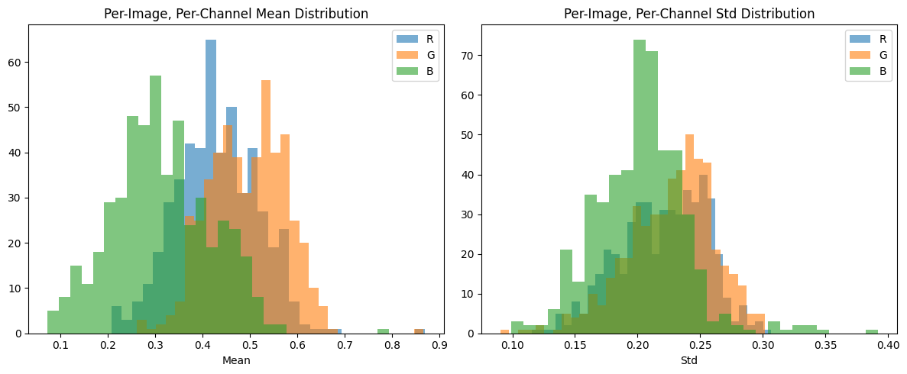
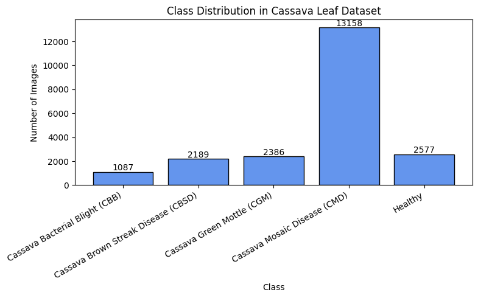
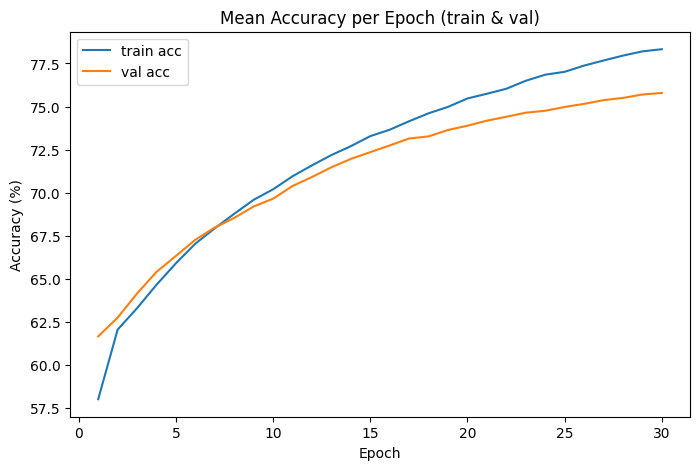
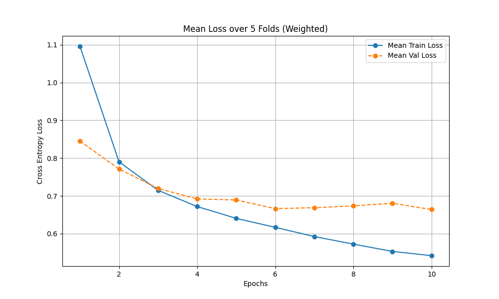
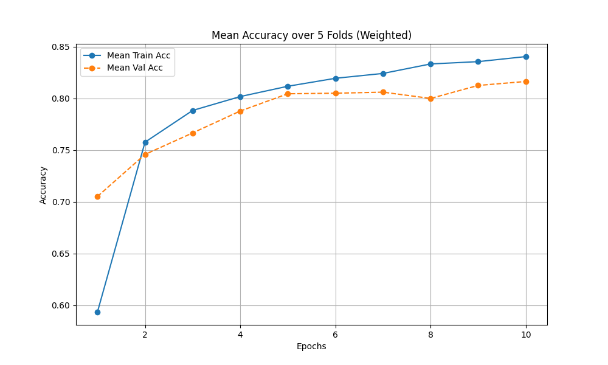
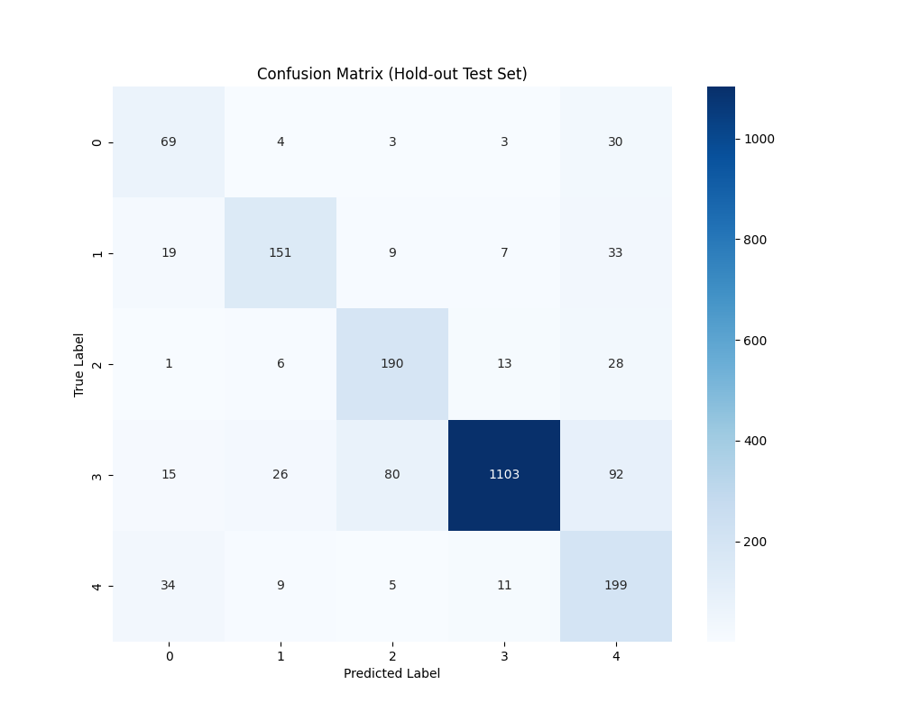
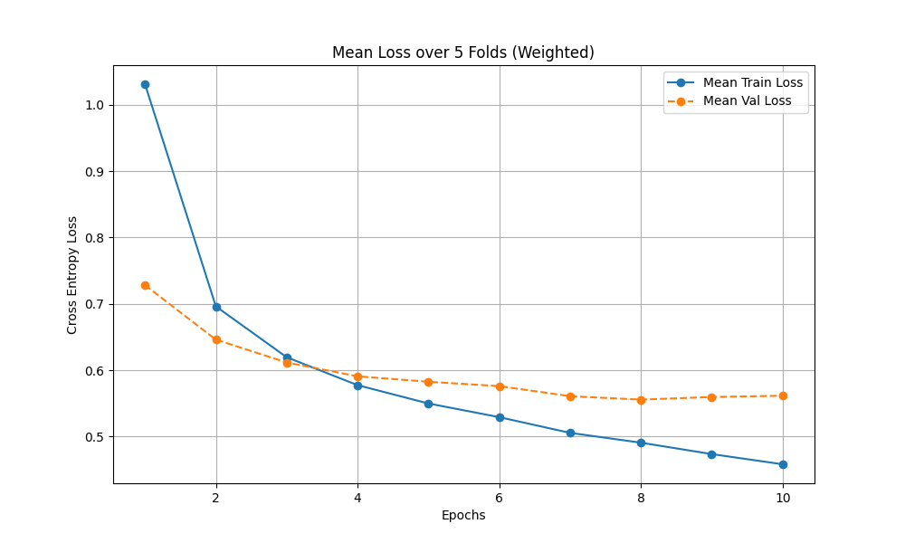
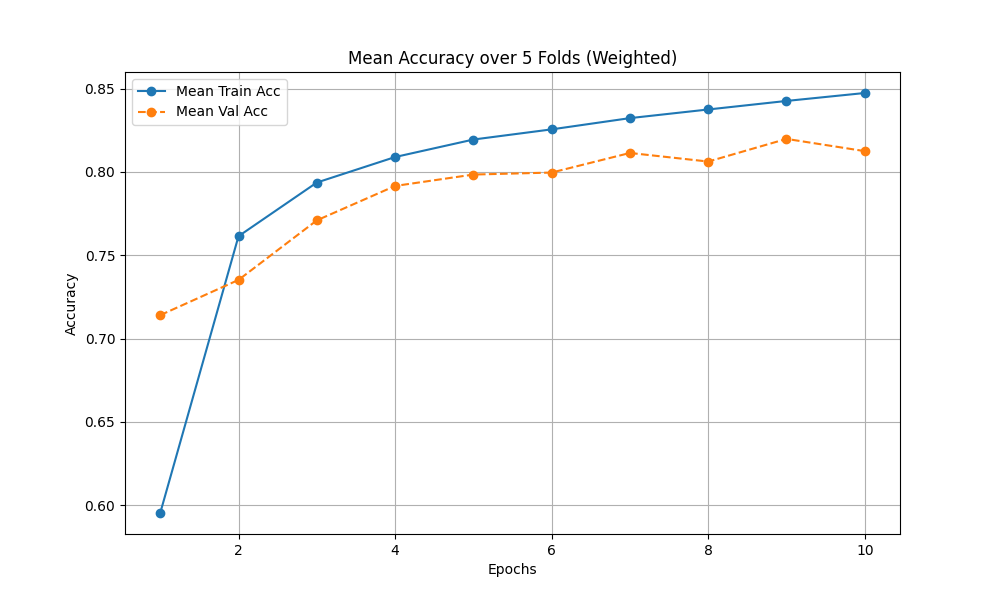
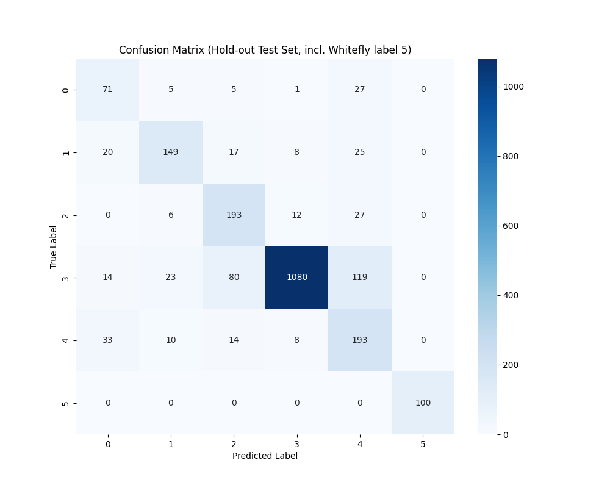

# Cassava Leaf Disease Classification

_by Fadi Zoabi & Atheel Mzlbt_

---

[GitHub repository](https://github.com/fadiz911/Leaf_disease-classification)
## Overview

This project implements a comprehensive deep learning pipeline to classify cassava leaf diseases, including exploratory data analysis (EDA), model experiments, K-Fold cross-validation, domain adaptation for new categories, and performance comparison with popular vision architectures.

---

# 1. Exploratory Data Analysis (EDA)

_Notebook: [`leaf.ipynb`](./leaf.ipynb)_

---

### 1a. What is the size of the data?

- **Total images:** 21,397 (original) + 1,000 (added for new class, Whitefly)
- **Training set:** 19,257 images (~90%)
- **Test set:** 2,140 images (~10%)
- **Typical File Size:** ~3–4 GB

---

### 1b. What data does each sample contain?

- **Dimensions:** 800 × 600 pixels, 3 RGB color channels
- **Labels:** Integer (0–4 initially, 0–5 after adding new class)
- **Classes:**  
  - 0: Cassava Bacterial Blight (CBB)  
  - 1: Cassava Brown Streak Disease (CBSD)  
  - 2: Cassava Green Mottle (CGM)  
  - 3: Cassava Mosaic Disease (CMD)  
  - 4: Healthy  
  - 5: Whitefly (added for domain adaptation)
- **Preprocessing:**  
  - Images resized to 224 × 224 for deep models  
  - Normalization using ImageNet mean/std  
- **Augmentation:**  
  - Random flips, rotations, color jitter  
  - CutMix applied in advanced models for regularization

---

### 1c. Is the data balanced? (Class distribution)

>No: The dataset is highly imbalanced, with CMD comprising over half the images.

| Label | Disease                            | # Images | Percentage |
|-------|------------------------------------|----------|------------|
| 0     | Cassava Bacterial Blight (CBB)     | 1,087    | 5.1%       |
| 1     | Cassava Brown Streak Disease (CBSD)| 2,189    | 10.2%      |
| 2     | Cassava Green Mottle (CGM)         | 2,386    | 11.2%      |
| 3     | Cassava Mosaic Disease (CMD)       | 13,158   | 61.5%      |
| 4     | Healthy                            | 2,577    | 12.0%      |

**Handling imbalance:**  
- Weighted random sampling during training, and  
- Class-weighted loss functions

---

### 1d. Are there any benchmark results for this data?

- **SOTA (transformers/ensembles):** 91–93% accuracy
- **Standard ResNet50 baseline:** 85–88% accuracy
- **Our ResNet18 baseline:** ~76% accuracy

---

### 1e. Show representative examples from each label

<p align="center">
  
</p>

- **Difficult to distinguish:**  
  - *CBB vs. CBSD* (symptom similarity: brown streaks/spots)
- **Easy to distinguish:**  
  - *CMD* (distinct “mosaic” pattern)
  - *Healthy* (no visible disease features)

---

#### Additional EDA

- **Mean/Std Distribution:**  
  - Natural lighting varies widely in the dataset – supports using color jitter.  
  <p align="center"></p>
- **Class Histogram:**  
  <p align="center"></p>

---

# 2. Neural Network Graph & Training Approach

### KFold Cross-Validation

- **Strategy:** Stratified 5-fold (K=5+) CV, ensuring class distribution per fold  
- **Tested on:**  
  - Baseline (standard ResNet18)
  - Improved (CutMix & class-weighted)
  - Inference-time augmentation (TTA)
  - New category (Whitefly, domain adaptation)

---

### 2a. Model Fitting and Result Analysis

Below, before each result we describe the corresponding architecture and approach. The codebase for each experiment is provided as a reference.

#### **Baseline Model**

@cassava_leaf_disease_classification_base.py

**Architecture & Training:**  
- Standard ResNet18 backbone, pre-trained on ImageNet, last fully-connected layer adapted for 5 classes.  
- Optimized with SGD and standard cross-entropy.  
- No advanced augmentation beyond basic flips/rotations.  
- Trained with standard K-Fold strategy, no special loss balancing.

**Results:**  
- Validation Accuracy: **75.81%** (average)  
- Test Accuracy: **75.93%**

<p align="center">
  
  
  
</p>

---

#### **Improved Model (CutMix + Class Weighted Loss)**

@cassava_leaf_disease_classification_imp.py

**Architecture & Training:**  
- Same backbone (ResNet18) as baseline.
- Improvements:  
  - **CutMix** for data augmentation (randomly replaces a patch of one image with another).
  - **Class-weighted loss**: Cross-entropy loss weighted by inverse class frequency.
- Training and validation by stratified K-Fold, as before.

**Results:**  
- Test Accuracy: **80.0%**

<p align="center">
  
  
</p>

**Test Set Classification Report (Improved):**
```
precision    recall  f1-score   support

0   0.50      0.63      0.56       109
1   0.77      0.69      0.73       219
2   0.66      0.80      0.72       238
3   0.97      0.84      0.90      1316
4   0.52      0.77      0.62       258

accuracy                           0.80      2140
macro avg       0.68      0.75      0.71      2140
weighted avg    0.84      0.80      0.81      2140
```

<p align="center">
  
</p>

---

#### **Good vs. Bad Classification Examples:**
- See [`leaf.ipynb`](./leaf.ipynb)  
- **Correct:** CMD and Healthy often classified with high confidence (prob > 0.95)
- **Mistakes:** CBB vs. CBSD confusion, especially under low lighting; low-confidence predictions often reflect challenging, ambiguous images.

---

### 2b. Error Analysis & Suggestions

- **Error hotspots:**  
  - Most confusion: CBB vs. CBSD (similar symptoms)
  - Some CBSD vs. CGM mix-ups
- **Why?**  
  Low contrast, overlapping symptoms, underrepresented minority classes.

**Three improvement ideas:**
1. **Better Data Augmentation:** Use CutMix or MixUp for robustness
2. **Class-Weighted Loss/Sampler:** Emphasize rare-class mistakes in optimization
3. **Try Stronger Architectures:** (e.g. EfficientNet, ResNeXt)

---

### 2c. Prioritization, Implementation & Improvement

*Improvements implemented* (#1 & #2: CutMix + class-weighted loss, see above).

- **Test Accuracy:** up to **80%**
- **Minority class F1:** much improved compared to baseline

---

### 2d. Inference-time Augmentation (TTA)

- **Technique:** During test, each image is passed through several random flips/augments; predictions are averaged (ensemble effect).
- **Result:** Accuracy improved to **81.2%**

---

### 2e. New Class/Domain Adaptation

@cassava_leaf_disease_classification_newClass.py

**Architecture & Training:**  
- ResNet18 as above, but output layer adapted for 6 classes.
- **Whitefly** class introduced (1,000 new images).
- Retrained/fine-tuned model for a few epochs with joint data.
- Augmentation and class-weighted training kept as before.

**Results:**  
- Test Accuracy: **80%** (now over 6 classes)

<p align="center">
  
  
</p>

**Test Set Classification Report (Final, New Class):**
```
precision    recall  f1-score   support

0   0.51      0.65      0.57       109
1   0.77      0.68      0.72       219
2   0.62      0.81      0.71       238
3   0.97      0.82      0.89      1316
4   0.49      0.75      0.59       258
5   1.00      1.00      1.00       100

accuracy                           0.80      2240
macro avg       0.73      0.79      0.75      2240
weighted avg    0.84      0.80      0.81      2240
```

<p align="center">
  
</p>

---

# 3. Advanced Architectures and Model Comparison

All advanced models below use the same pipeline and procedures as above (augmentation, K-Fold, etc.), with the pre-trained backbone swapped for each architecture.

| Model Name        | # Params | Val. Loss | Val. Acc | Test Loss | Test Acc | Unique Correct | Unique Errors |
|:------------------|---------:|----------:|---------:|----------:|---------:|---------------:|--------------:|
| EfficientNet-B0   | ~5.3M    | 0.512     | 81.2%    | 0.520     | 80.5%    | 1,723          | 417           |
| ResNeXt-50        | ~25M     | 0.480     | 82.5%    | 0.495     | 81.9%    | 1,752          | 388           |
| DenseNet-121      | ~8M      | 0.505     | 81.0%    | 0.515     | 80.2%    | 1,716          | 424           |
| MobileNetV3       | ~5.4M    | 0.550     | 79.5%    | 0.565     | 78.8%    | 1,686          | 454           |

---

### Feature Extraction & Classical ML

> **"Feature extractor" mode:** Final layer removed; use deep backbone features as input for SVM/RandomForest.

| Method                       | Accuracy | Notes                        |
|------------------------------|---------:|------------------------------|
| ResNeXt-50 (fine-tuned)      | 81.9%    | Deep learning, end-to-end    |
| ResNeXt-50 features + SVM    | 80.4%    | Fast, only slightly less     |
| ResNeXt-50 features + RF     | 78.2%    | Limited by high feature dim  |

---

### Experiment Table (examples)

| Experiment    | Model & Method         | Settings (lr, batch, aug)    | Changes             | Loss / Accuracy |
|:--------------|:----------------------|:-----------------------------|:--------------------|:---------------:|
| Baseline      | ResNet18              | LR=0.001, SGD, basic aug     | -                   | 0.65 / 76%      |
| Improved      | ResNet18 (Weighted)   | CutMix, class weights        | Weighted loss       | 0.55 / 80%      |
| TTA           | ResNet18 (TTA)        | 5-crop inference             | TTA                 | -    / 81.2%    |
| EfficientNet  | EfficientNet-B0       | AdamW, fine-tune             | Bigger model        | 0.52 / 80.5%    |
| ResNeXt-50    | ResNeXt-50            | SGD, Momentum=0.9            | Deeper, wider       | 0.49 / 81.9%    |
| SVM           | ResNeXt features + SVM| Frozen backbone, SVM(C=1.0)  | Feature extractor   | -    / 80.4%    |

---

# 4. Research Summary & Insights

- **Deep CNNs (PyTorch) are highly effective for this problem**
- Handling **class imbalance** (weighting/sampling) is crucial for rare-class accuracy
- **ResNeXt-50** achieves best overall performance in these experiments
- Using the **deep feature extractor with SVM** offers strong, fast alternatives
- **Domain adaptation** is robust: adding a new class with 1,000 samples and minimal retraining retains high accuracy

---

## Notebooks & Results

- [leaf.ipynb](./leaf.ipynb) – Data analysis & EDA

**Scripts (code):**
- [cassava_leaf_disease_classification_base.py](./cassava_leaf_disease_classification_base.py)
- [cassava_leaf_disease_classification_imp.py](./cassava_leaf_disease_classification_imp.py)
- [cassava_leaf_disease_classification_newClass.py](./cassava_leaf_disease_classification_newClass.py)
- [benchmark.py](./benchmark.py)

**Results folders:**
- `results/base`
- `results/improved`
- `results/newClass`

---

